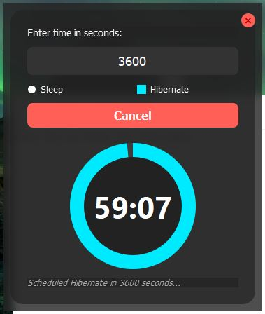

# Sleep/Hibernate Scheduler

A sleek, modern, and user-friendly desktop application for Windows to schedule your PC to sleep or hibernate after a set amount of time.




---

## Features

*   **Schedule Actions**: Easily schedule your computer to **Sleep** or **Hibernate**.
*   **Modern UI**: A beautiful "glassmorphism" interface with an acrylic blur effect on Windows 10/11.
*   **Visual Timer**: A circular, donut-style timer provides a clear visual countdown.
*   **Cancel Functionality**: A prominent cancel button allows you to stop a scheduled action at any time.
*   **Persistent Settings**: The app remembers the last duration and action you set, making it quicker to use next time.
*   **Frameless & Draggable**: A clean, borderless window that you can drag from anywhere.
*   **Cross-Platform**: Runs on other operating systems, though the sleep/hibernate actions are specific to Windows.

---

## Requirements

*   Python 3.6+
*   PyQt5

---

## Installation

1.  **Clone or download the repository:**
    If this were a git repository, you would clone it. For now, just make sure you have the `sleep_scheduler.py` file.

2.  **Create a virtual environment (recommended):**
    Open a terminal or command prompt in the project directory and run:
    ```bash
    python -m venv .venv
    ```
    Activate it:
    *   **On Windows:**
        ```bash
        .\.venv\Scripts\activate
        ```
    *   **On macOS/Linux:**
        ```bash
        source .venv/bin/activate
        ```

3.  **Install the required package:**
    With your virtual environment active, install PyQt5:
    ```bash
    pip install PyQt5
    ```

---

## Usage

To run the application, simply execute the Python script from your terminal:

```bash
python sleep_scheduler.py
```

1.  Enter the desired time in seconds into the input field.
2.  Select either "Sleep" or "Hibernate".
3.  Click the "Schedule" button to start the countdown.
4.  To stop the countdown at any time, click the red "Cancel" button.

---

## How It Works

*   **GUI**: The graphical user interface is built using the **PyQt5** framework.
*   **Background Action**: A `threading.Thread` is used to run the timer countdown, ensuring the UI remains responsive and doesn't freeze.
*   **Windows Blur**: The acrylic blur effect is achieved by making calls to the Windows native API (`user32.dll`) using Python's `ctypes` library.
*   **System Actions**: The sleep and hibernate commands are executed using Python's `subprocess` and `os` modules, which are standard libraries for running system commands.
*   **Settings**: User preferences (last duration and action) are saved locally in a `settings.json` file for persistence between sessions.

---

## License

This project is open-source and can be considered under the MIT License.